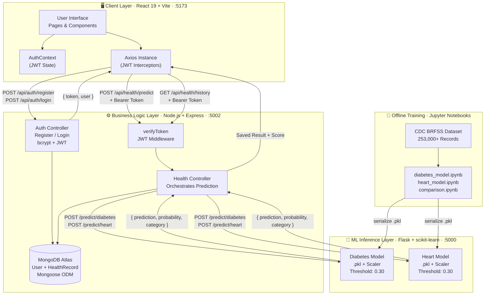

<div align="center">

<br/>

<!-- Typing SVG banner -->


<br/>

<p align="center">
  
  
  
  
  
  
  
</p>

<p align="center">
  <a href="https://github.com/Vidhya-Majee/VitalCheck/stargazers">
    
  </a>
  <a href="https://github.com/Vidhya-Majee/VitalCheck/network/members">
    
  </a>
  
</p>

<br/>

> **VitalCheck** is a full-stack, AI-powered health risk prediction platform.
> Enter your health metrics — get an instant, ML-backed risk score for **Diabetes** and **Heart Disease**.
> No guessing. No jargon. Just clear, actionable health insights.

<br/>

---

</div>

## ✨ Features at a Glance

| Feature | Description |
|---|---|
| 🧠 **Dual Disease Prediction** | Independent risk models for **Diabetes** and **Heart Disease** |
| 📊 **Probability-Based Scores** | Real probability score (not just yes/no) for nuanced clinical insight |
| 🔐 **Secure JWT Auth** | Register, login, and protect your health data with signed tokens |
| 📜 **History Tracking** | Every prediction persisted — monitor your health trends over time |
| ⚡ **Instant Predictions** | Flask ML microservice responds in milliseconds via an optimized pipeline |
| 📱 **Responsive UI** | Looks stunning on desktop, tablet, and mobile |
| 🎨 **Premium Design** | ECG pulse animations, glassmorphic cards, dark-gradient hero |

---

## 🏗️ Architecture Overview

VitalCheck is built on a **three-tier microservice architecture** where each layer has a distinct responsibility — the frontend handles UX, the Node.js backend manages auth and persistence, and the Flask microservice owns all ML inference. This separation keeps ML dependencies isolated from the business logic layer.



---

### 🔄 Request Data Flow

```
User fills form (21 fields)
        │
        ▼
   React Frontend   ──► Axios + JWT ──►   Node.js Backend
                                                  │
                                          Validates JWT token
                                                  │
                                          Forwards payload to
                                        Flask ML Microservice
                                                  │
                                      ┌─────────────────────┐
                                      │   Flask: scale →    │
                                      │  predict_proba() →  │
                                      │  threshold (0.30) → │
                                      │  category label     │
                                      └─────────────────────┘
                                                  │
                                      Saves HealthRecord to MongoDB
                                                  │
                                        Returns result to frontend
                                                  │
                                        ▼
                              Result.jsx displays Risk Score,
                              Probability, and Category
```

---

### 🧩 Layer Breakdown

| Layer | Technology | Port | Responsibility |
|---|---|---|---|
| **Frontend** | React 19, Vite, Tailwind CSS v4 | `:5173` | UI, routing, form collection, JWT storage |
| **Backend API** | Node.js, Express.js, Mongoose | `:5002` | Auth, JWT guard, ML orchestration, DB writes |
| **ML Microservice** | Python 3.9+, Flask, scikit-learn | `:5000` | Feature scaling, model inference, risk scoring |
| **Database** | MongoDB Atlas | Cloud | User accounts, prediction history persistence |
| **ML Training** | Jupyter, scikit-learn, pandas | Offline | Model training, evaluation, serialization |

---

### 🔐 Auth & Security Flow

```
Registration:  name + email + password ──► bcrypt hash ──► MongoDB User
Login:         email + password ──► bcrypt.compare() ──► JWT signed token
Protected:     Request + Bearer token ──► verifyToken middleware ──► controller
```

- All sensitive routes guarded by `verifyToken.js` JWT middleware
- Passwords never stored in plaintext — always bcrypt-hashed
- Secrets (`MONGO_URI`, `JWT_SECRET`) live exclusively in `.env`

---

## 📁 Project Structure

```
predictive-healthcare/
│
├── 📂 frontend/                  # React + Vite SPA
│   └── src/
│       ├── pages/
│       │   ├── Login.jsx
│       │   ├── Signup.jsx
│       │   ├── Dashboard.jsx     # Health check launcher
│       │   ├── HealthForm.jsx    # Diabetes intake form (21 fields)
│       │   ├── HeartForm.jsx     # Heart disease intake form (21 fields)
│       │   ├── Result.jsx        # Prediction result display
│       │   └── History.jsx       # Past predictions timeline
│       ├── components/
│       │   ├── Layout.jsx
│       │   ├── Sidebar.jsx
│       │   ├── PulseLine.jsx     # Animated ECG component
│       │   ├── RiskSummary.jsx
│       │   ├── SplashScreen.jsx
│       │   ├── NumberField.jsx
│       │   └── YesNoToggle.jsx
│       └── api/
│           └── axiosInstance.js  # Axios + JWT interceptors
│
├── 📂 backend/                   # Express.js REST API
│   ├── controllers/
│   │   ├── authController.js     # Register / Login logic
│   │   └── healthController.js   # Prediction orchestration
│   ├── models/
│   │   ├── User.js               # Mongoose user schema
│   │   └── HealthRecord.js       # Prediction history schema
│   ├── routes/
│   │   ├── authRoutes.js
│   │   └── healthRoutes.js
│   ├── middleware/
│   │   └── verifyToken.js        # JWT guard middleware
│   └── server.js
│
├── 📂 flask-api/                 # Python ML microservice
│   ├── app.py                    # /predict/diabetes & /predict/heart
│   └── models/
│       ├── diabetes_model.pkl
│       ├── diabetes_scaler.pkl
│       ├── heart_model.pkl
│       └── heart_scaler.pkl
│
└── 📂 ml-model/                  # Jupyter training notebooks
    └── notebooks/
        ├── diabetes_model.ipynb
        ├── heart_model.ipynb
        └── comparison.ipynb      # Model benchmarking
```

---

## 🤖 Machine Learning Models

Both models were trained on the **CDC BRFSS dataset** (253,000+ real-world records) and serialized as `scikit-learn` pipelines with dedicated scalers.

### 🩸 Diabetes Risk Model

| Detail | Value |
|--------|-------|
| Dataset | CDC BRFSS (binary classification) |
| Input Features | 21 health & lifestyle indicators |
| Decision Threshold | 0.30 (tuned for high sensitivity) |
| **Recall** | **~80%** |

**Features:** `HighBP`, `HighChol`, `CholCheck`, `BMI`, `Smoker`, `Stroke`, `HeartDiseaseorAttack`, `PhysActivity`, `Fruits`, `Veggies`, `HvyAlcoholConsump`, `AnyHealthcare`, `NoDocbcCost`, `GenHlth`, `MentHlth`, `PhysHlth`, `DiffWalk`, `Sex`, `Age`, `Education`, `Income`

### ❤️ Heart Disease Risk Model

| Detail | Value |
|--------|-------|
| Dataset | CDC BRFSS (binary classification) |
| Input Features | 21 health & lifestyle indicators |
| Decision Threshold | 0.30 (tuned for high sensitivity) |
| **Recall** | **~82%** |

**Features:** Same lifestyle + biometric markers — swaps `HeartDiseaseorAttack` for `Diabetes` status.

> 📓 Training, evaluation, and cross-validation documented in `ml-model/notebooks/comparison.ipynb`.
> Algorithms benchmarked: Logistic Regression, Random Forest, Gradient Boosting.

---

## 🚀 Getting Started

### Prerequisites

| Tool | Version |
|------|---------|
| Node.js | ≥ 18 |
| Python | ≥ 3.9 |
| MongoDB | Local or Atlas |
| pip | Latest |

### 1️⃣ Clone the Repository

```bash
git clone https://github.com/Vidhya-Majee/VitalCheck.git
cd VitalCheck
```

### 2️⃣ Start the Flask ML API

```bash
cd flask-api
pip install flask flask-cors scikit-learn joblib numpy
python app.py
```

> ✅ Flask API live at **http://localhost:5000**

### 3️⃣ Configure & Start the Node.js Backend

```bash
cd backend
npm install
```

Copy and fill the environment file:

```bash
# Windows
copy .env.example .env

# macOS / Linux
cp .env.example .env
```

```env
MONGO_URI=your_mongodb_connection_string_here
JWT_SECRET=your_super_secret_key_here
FLASK_API_URL=http://127.0.0.1:5000
PORT=5002
```

```bash
node server.js
```

> ✅ Express API live at **http://localhost:5002**

### 4️⃣ Start the React Frontend

```bash
cd frontend
npm install
npm run dev
```

> ✅ App live at **http://localhost:5173**

---

## 🔌 API Reference

### 🔓 Auth — Node.js (port 5002)

| Method | Endpoint | Body | Response |
|--------|----------|------|----------|
| `POST` | `/api/auth/register` | `{ name, email, password }` | `{ token, user }` |
| `POST` | `/api/auth/login` | `{ email, password }` | `{ token, user }` |

### 🔒 Health — Node.js (port 5002) · *JWT Required*

| Method | Endpoint | Description |
|--------|----------|-------------|
| `POST` | `/api/health/predict` | Submit form → call Flask → save & return result |
| `GET` | `/api/health/history` | Retrieve all past predictions for logged-in user |

### 🧪 ML — Flask (port 5000)

| Method | Endpoint | Description |
|--------|----------|-------------|
| `GET` | `/health` | Flask health check |
| `POST` | `/predict/diabetes` | Returns `{ prediction, probability, category }` |
| `POST` | `/predict/heart` | Returns `{ prediction, probability, category }` |

**Example Response:**
```json
{
  "prediction": 1,
  "probability": 0.7432,
  "category": "High Risk"
}
```

---

## 🛡️ Security

- 🔑 Passwords hashed with **bcrypt** before storage
- 🪪 All protected routes guarded by **JWT middleware**
- 🌐 **CORS** configured on both Flask and Express
- 🔒 Secrets managed via **`.env`** files — never committed to git
- ⚠️ `.env.example` provided as a safe contributor template

---

## 🗺️ Roadmap

- [ ] 📊 Historical trend charts with Recharts visualization
- [ ] 🫁 Lung disease & stroke risk models
- [ ] 🤖 Personalized lifestyle recommendations via LLM
- [ ] 🔔 Email / SMS risk alert notifications
- [ ] 📱 React Native mobile app
- [ ] 🌐 Production deployment (Vercel + Railway + Render)
- [ ] 🧪 Unit & integration test coverage

---

## 🤝 Contributing

Contributions, ideas, and bug reports are very welcome!

1. **Fork** the repository
2. **Create** your feature branch: `git checkout -b feat/your-feature`
3. **Commit** your changes: `git commit -m "feat: add your feature"`
4. **Push** to the branch: `git push origin feat/your-feature`
5. **Open** a Pull Request 🎉

---

## 📄 License

This project is licensed under the **MIT License**.

---

<div align="center">

<br/>

**Made with ❤️ and lots of ☕ by [Vidhya Majee](https://github.com/Vidhya-Majee)**

<br/>

*VitalCheck — Know your risk. Act early. Live better.*

<br/>

⭐ **If this project helped you, please give it a star!** ⭐

</div>
